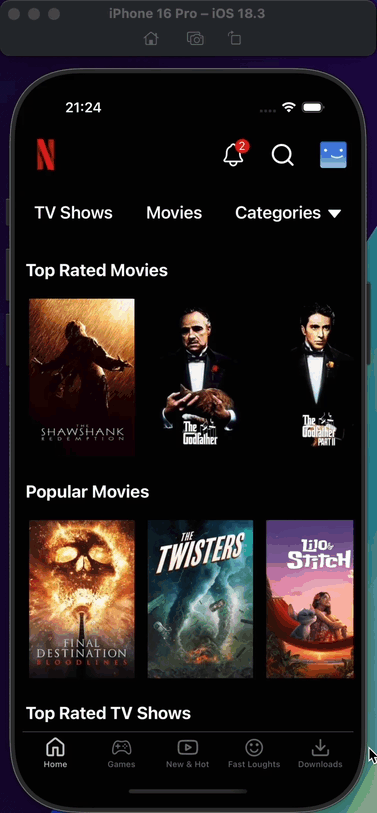

<h1>Netflix App</h1>

This project is a clone of Netflix, a movie developed with React Native. Application consists of home page, games page, new and hots page, fast loughts page, downloads page, movie detail page and notifications page. Users can view movies on home page and they can also view movie details on movie details page. They can also access incoming notifications from the notifications page

<h2>Used Technologies</h2>

<ul>

<li>@react-native-firebase/app</li>
<li>@react-native-firebase/messaging</li>
<li>@react-navigation/native</li>
<li>@react-navigation/native-stack</li>
<li>@react-navigation/bottom-tabs</li>
<li>@reduxjs/toolkit</li>
<li>axios</li>
<li>nativewind</li>
<li>react-native-reanimated</li>
<li>react-native-safe-area-context</li>
<li>react-native-screens</li>
<li>react-native-vector-icons</li>
<li>react-redux</li>
<li>tailwindcss</li>

</ul>

<h1>Screen Gifs</h1>

